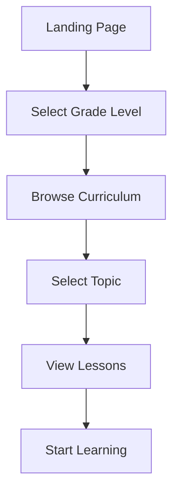
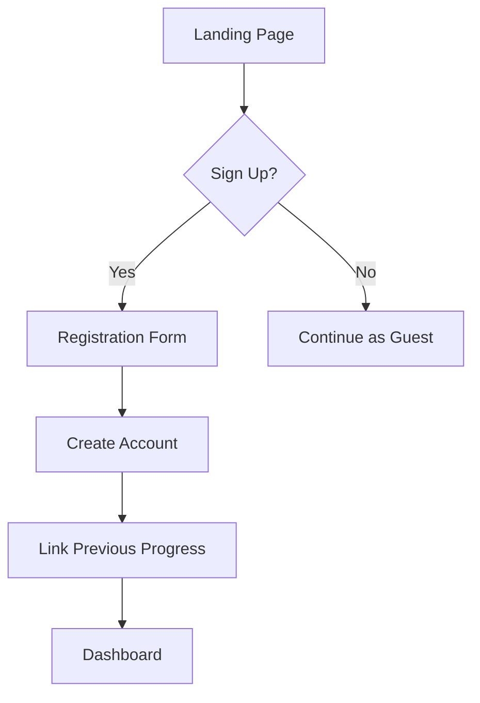
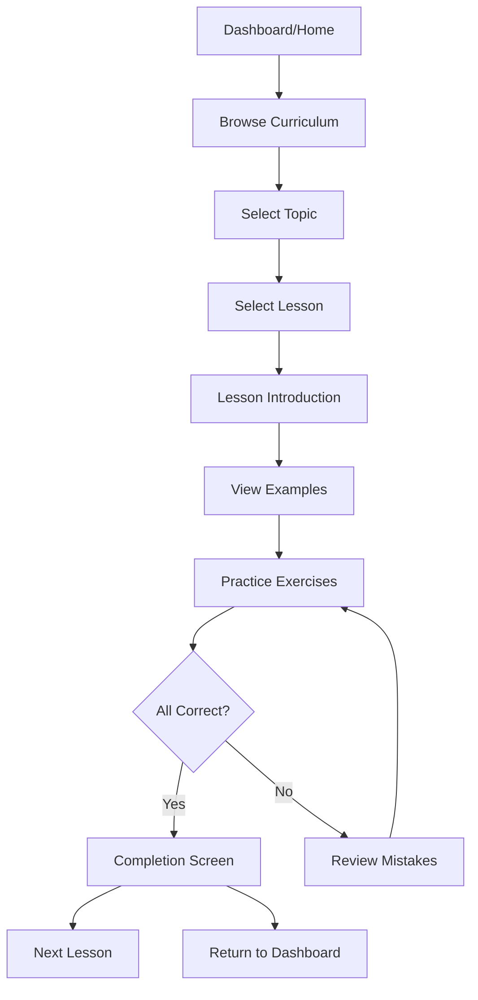
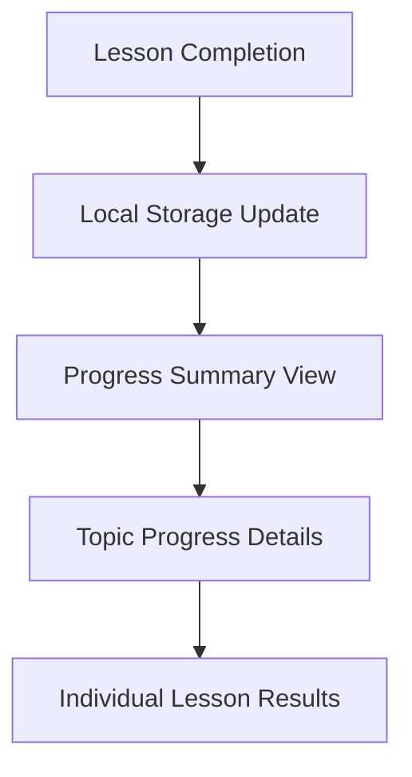
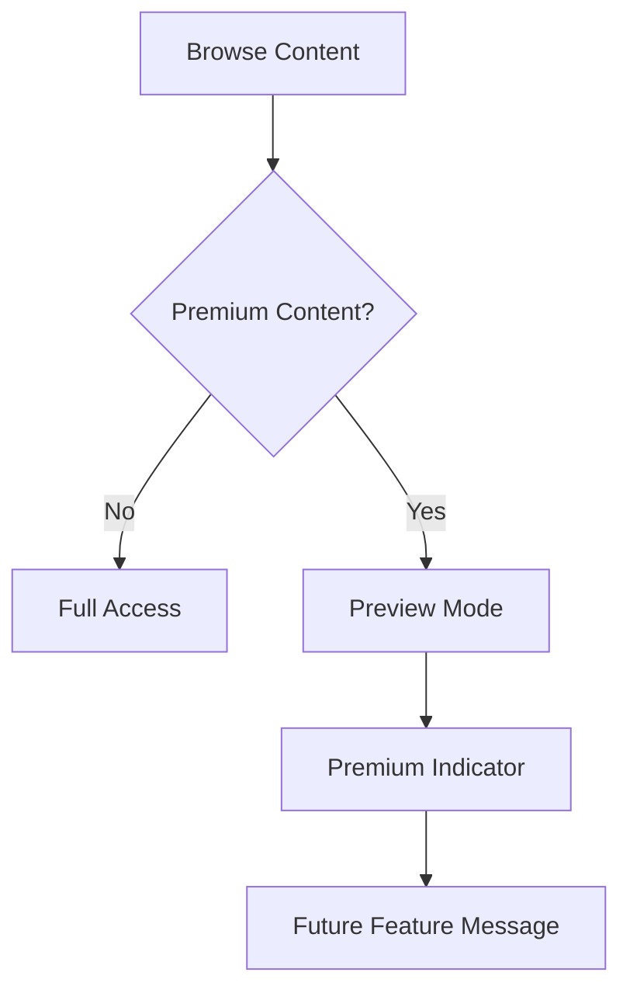
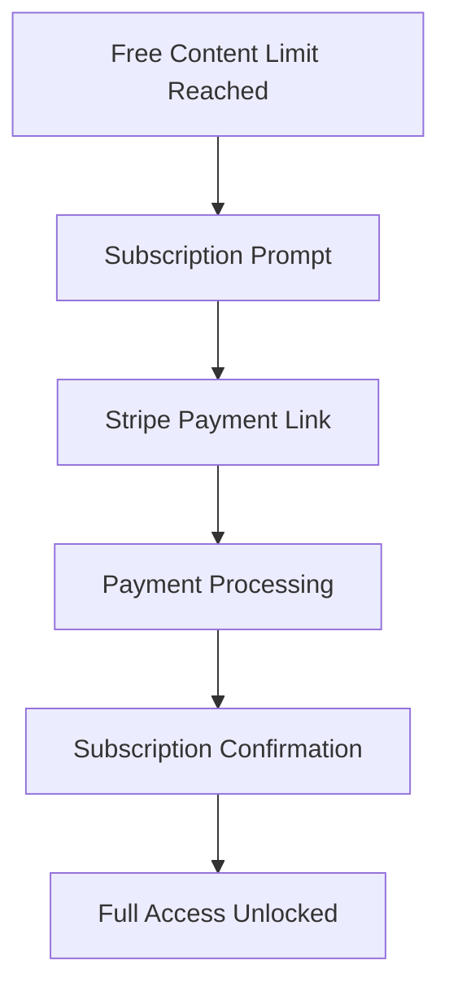
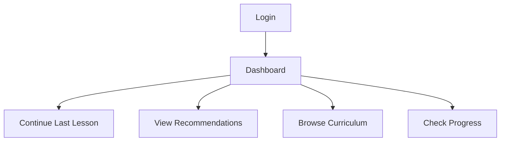
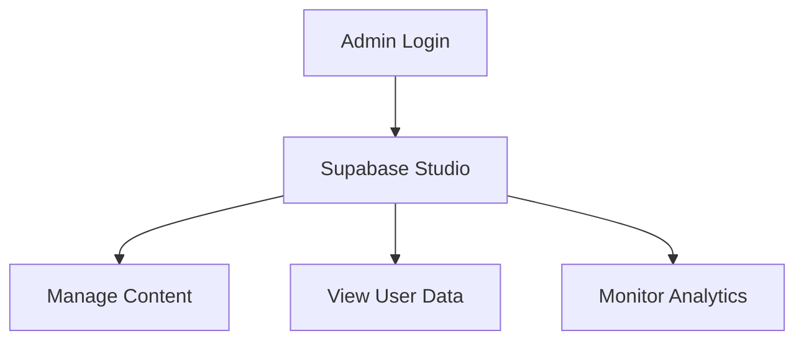

# User Flow

This document outlines the complete user journey through the application, focusing on the MVP implementation.

## 1. First-Time User Experience (MVP Phase 1-2)

### 1.1 Landing Page
- **Content**: Value proposition, features overview, sample lessons
- **Actions**: Select grade level, Browse curriculum
- **Goal**: Communicate app value and provide immediate access to content

### 1.2 Grade Selection
- **Method**: Simple dropdown or visual selection
- **Process**: One-click selection without account requirement

### 1.3 Curriculum Browsing
- **Organization**: By topic within selected grade
- **Display**: Visual cards with topic descriptions

## 1. Authentication (MVP Phase 2 - Added Later)

### Future Authentication Features
- **Method**: Email/password via Supabase Auth
- **Fields**: Email, password, grade level interest
- **Process**: Simple one-step form with minimal friction
- **Progress Linking**: Option to link previous local progress

## 2. Core Learning Experience

### 2.1 Curriculum Navigation
- **Entry Points**: Dashboard, Curriculum menu, Search
- **Organization**: By grade → topic → lesson
- **Display**: Visual cards with progress indicators

### 2.2 Lesson Flow
- **Introduction**:
  - Video or text explanation of concept
  - Key points highlighted
  - Visual aids and examples

- **Examples**:
  - Step-by-step walkthroughs
  - Interactive demonstrations
  - Guided practice

- **Practice Exercises**:
  - Multiple question types
  - Immediate feedback
  - Hints available
  - Progress tracking

### 2.3 Completion & Progress
- **Feedback**: Score, correct/incorrect answers, explanations
- **Next Steps**: Suggested next lesson
- **Progress Update**: Dashboard updated with completion status

## 3. Progress Tracking (Initial Implementation - MVP Phase 1-2)

### 3.1 Local Progress Tracking
- **Storage Method**: Browser's localStorage
- **Tracked Data**: 
  - Completed lessons
  - Exercise scores
  - Last visited content

### 3.2 Progress Visualization
- **Visual Indicators**: Completion badges on lesson cards
- **Progress Bars**: Topic completion percentage
- **Exercise Results**: Score summary for completed exercises

### 3.3 Future Progress Features (MVP Phase 2)
- **Persistent Storage**: Migration to Supabase
- **Advanced Metrics**: Learning streaks, time spent
- **Personalized Recommendations**: Based on performance

## 4. Content Access (Initial Implementation - MVP Phase 1-2)

### 4.1 Free vs. Premium Content
- **Indicators**: Clear labeling of premium content
- **Preview Mode**: Limited access to premium content
- **Future Feature Message**: Notification that payment functionality will be available soon

## 5. Subscription Flow (To be implemented in MVP Phase 2)

### 5.1 Planned Payment Process
- **Method**: Stripe Payment Links (minimal integration)
- **Options**: Monthly/annual subscription
- **Confirmation**: Email receipt and account status update

## 5. Return User Experience

### 5.1 Login
- **Method**: Email/password via Supabase Auth
- **Features**: Remember me, password reset

### 5.2 Personalized Dashboard
- **Welcome Back**: Resume learning prompt
- **Progress Update**: Changes since last visit
- **Recommendations**: Based on previous activity

## 6. Error Handling & Edge Cases

### 6.1 Connection Issues
- Offline message
- Retry mechanisms
- Local storage of progress when possible

### 6.2 Authentication Failures
- Clear error messages
- Password reset flow
- Support contact option

### 6.3 Payment Issues
- Alternative payment options
- Support contact information
- Graceful error handling

## 7. Administrative Flow (Minimal for MVP)

### 7.1 Content Management
- Direct database management via Supabase Studio
- Structured content templates
- API integration management

### 7.2 User Management
- View registered users
- Manage subscription status
- Access basic analytics

---

This user flow document focuses on the MVP implementation, prioritizing a smooth core learning experience while using no-code/low-code solutions for supporting features like authentication and payments.
